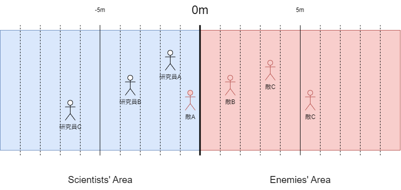

# 戦闘(パークマスター向け) {#title}

本ページでは、戦闘に関してPMが考慮するべきルールを記載する。
戦闘は複数のルールが混在している状況であるため、それぞれ章立てして記載する。

## 全ルール共通 {#common}

### 事前に用意する物 {#prepare}

いずれの先頭に置いても必ず必要な物がある。
この章では、それらをどのように設定するべきかを明記する。

- 敵のデータ
- ステージの環境
- イベント表
- ドロップアイテム表
- 各種ダイス

#### 敵のデータ {#enemy_data}

敵には、以下のステータス・パラメータは最低限設定しなければならない。
ほとんどは研究員の同名ステータス・パラメータと同様なので、以下がどのようなステータスであるかを知りたいときは、[「ステータス・パラメータ編」](../data_catalog/parameters.md)を参照して欲しい。
使いどころは直下の文章で記述する。

##### 必須ステータス {#nessecary_status_to_enemy}

- HP
- SS

##### 必須パラメータ {#nessecary_parameter_to_enemy}

筋力
:   - 格闘
        - 格闘攻撃の命中判定
    - 投擲
        - 投擲攻撃の判定

 敏捷力
:   - イニシアチブ判定
    - 射撃
        - 射撃攻撃の命中判定

魔力
:   - 魔法
        - 魔法攻撃の命中判定

判断力
:   - 回避
        - 相手からの攻撃の回避判定
    - 精神抵抗
        - メンタル系状態異常の抵抗判定

耐久力
:   - 肉体抵抗
        - フィジカル系状態異常の抵抗

所持金
:   この敵の所持金。

    - 戦闘終了後

経験値
:   この敵を斃したときに得られる経験値量

    - 戦闘終了後

なお、以下のステータス、パラメータ、設定は任意につけてもよい。
敵のスペシャル・ムーブやバックボーンなど、特性に合わせて適宜設定しよう。

##### 任意ステータス {#optional_status_to_enemy}

人間度

##### 任意パラメータ {#optional_parameter_to_enemy}

運
:   - その他抵抗
        - カース系、シックネス系の状態異常に対する抵抗判定

知力
:   - (各種知力技能)

    イベントを除き、戦闘にはあまり使わない。
キャラ付に

魅力
:   - (各種知力技能)

    研究員との心理戦で使うかも知れない

耐性
:   ここに記した属性の攻撃を食らうとダメージ半減

弱点
:   ここに記した属性の攻撃を食らうとダメージ2倍

完全耐性
:   ここに記した属性の攻撃は無条件でMISSになる

致命的弱点
:   ここに記した属性の攻撃を食らうとダメージ3倍!!!

##### その他設定 {#else_data_to_enemy}

性格

容姿

#### ステージの環境 {#environment}

その名の通り、戦闘の舞台における自然環境やそれによって研究員や敵が受ける影響などを表したものである。

例えば、森の豪雨や霧の中であれば視界が悪くなるし、砂漠で日照りにでも遭おうものなら体力が否応なしに削られていく。
そのような過酷な環境を設定したいときは、これを追加で付け加えると良いだろう。

基本的に設定項目は、「地形」と「気候」の大項目に分けられる。
いずれにも小項目として、「名称」「演出」「効果」の3種類がある。
名称は、その環境が一般的になんと呼ばれているかを表す。
また、テキスト上どう表現したいかは「演出」に、それによって研究員や敵のステータスが受ける影響は「効果」に書き記す必要がある。
ただし、両方の大項目を必ず設定しなければいけないわけではなく、基本的には、研究員や敵に直ちに影響のあるもののみを書き加えるべきである。
例えば、快晴故に絶好調だとか、草原地帯で比較的見渡しがいいなど、「効果」に書くようなことがなにもない環境は、この項目ではなくシナリオ上に載せておくべきだ。

以下にそれぞれの大項目の例を挙げる。

##### 地形(例) {#terrian}

|名称|演出|効果|
|----|----|----|
|ぬかるみ|足がもつれて動きづらい|空を飛ぶ者以外、全員移動力-1|
|氷の上|すべる！！！|移動時、敏捷力判定(難易度10)に失敗すると、伏せ状態になり行動が強制終了|
|洞窟の中|まっくらやみだ！|スペシャル・ムーブ「暗視」を持たない者は、全ての命中判定の達成度-5|

##### 気候(例) {#weather}

|名称|演出|効果|
|----|----|----|
|砂嵐|目に砂が入って前が見えない！|全ての命中判定の達成度-5|
|豪雪|凍えるような寒さだ|毎ターン全員のHPに1d4のダメージ|
|毒ガス|気分が悪くなってきた……|偶数ターン時、ランダムな2人に状態異常「毒」付与|

#### イベント表 {#event_table}

イベント表とは「戦闘内イベント」を一覧にしたものである。

例えば、もし研究員がどうしても勝てない敵に囲まれてしまったとき、一流のセルリアンキラーが助けに来てくれるかもしれない。
あるいは、だれかと交戦中にもっとヤバイ奴が乱入してきて、戦闘が強制的に中断されるかもしれない。
普通に天候が悪化して戦局がガラッと変わる可能性もあるし、なんなら敵のスペシャル・ムーブそのものが次のシーンのトリガになっていることもある。
そういうシステムだけでは補えない描写全般が「戦闘内イベント」である。
イベント表は、それら戦闘内イベントやイベントの発動条件(トリガ)を一覧にしたものである。

説明だけではわかりづらいと思うので、書き方の例を以下に挙げる。

> |イベント名|イベントトリガ|
> |----|----|
> |中ボス乱入|3ターン経過|
> |アイテム補給|誰かのHPが残り10%前後になったとき|
>
> #### イベント「中ボス乱入」
>
>> PM：君たちが戦闘に手こずっていると、遠くから咆哮が聞こえてくる……。
>> 大型セルリアンが、君たちの前に現れた！
>
> ##### 「中ボス乱入」処理
>
> 1. 大型セルリアンを(●●に)追加。
>
> ##### イベント「アイテム補給」
>
>> PM：君がやられそうになったとき、どこからともなく声が聞こえてくる
>>
>> ???：これを使え！
>>
>> PM：直後、君の目の前にポーションが投げつけられた。
>> 君はポーションを手に入れた！
>
> ##### 「アイテム補給」処理
>
> 1. 一番体力の少ない研究員に、ポーション＊1を付与
>

基本的にイベント表は、「イベントトリガ表」(上記例のテーブル)と「イベント詳細」(上記例の文章部分)の2つに大別することが出来る。
イベントトリガ表には、イベント名とそのイベントのトリガを、イベントごとに設定していく。
戦闘中にイベントトリガが満たされたら、そのイベント名に対応したイベントを発動しなければならない。
そして、そのイベント内で発生する描写や処理を明記したものが、イベント詳細だ。
イベントは基本的にイベント詳細に則って描写していくとよい。

#### ドロップアイテム表 {#drop_item_table}

「ドロップアイテム表は」、戦闘終了後の報酬をまとめたものである。
戦闘そのものにも報酬は欠かせない。
基本的にこのゲームには敵一体一体に経験値やお金、ドロップアイテムなどの戦闘報酬が設定されており、それらを計上した上で研究員に報酬を提供するシステムになっているが、それをいちいち計上していると面倒くさいしミスも発生しうる。
それらをまとめているのが「ドロップアイテム表」である。

まず、書き方を以下に記載する。

> 敵グループ1：
> ノーマルセルリアン(青)＊2
> ノーマルセルリアン(赤)＊1
>
> 経験値：100
> ゴールド：700G
>
> ドロップアイテム表
>
> |敵名|アイテム名|落とす出目|
> |:-|:-|:-|
> |ノーマル青A|石ころ|1-40|
> ||黒曜石|41-50|
> ||はずれ|51-|
> |ノーマル青B|石ころ|1-40|
> ||黒曜石|41-50|
> ||はずれ|51-|
> |ノーマル赤|石ころ|1-30|
> ||琥珀|31-40|
> ||はずれ|41-|
>

以上のドロップアイテム表には5つの要点がある。

敵グループ名
:   敵グループの名前。
    セッション中に表に出す必要はない。わかりやすい名前をつけよう。

敵の一覧
:   敵の大まかな情報を表す。
    敵の名前がわかればそれでよい。

合計経験値・合計報酬金額
:   敵が出す経験値とお金の総額を表す。
    必須項目ではないが、付け加えておくと計算が楽になる。

ドロップアイテム表
:   ドロップアイテム表のメインとなる要素。
    敵1体1体にドロップアイテムの設定が行われている。
    戦闘終了後には敵の数だけd100を振って、その出目が「落とす出目」の範囲内であるアイテムをプレイヤーに付与する必要がある。
    たとえば、戦闘終了後に1d100を3回振って、結果が[60, 30, 35]であった場合は、ドロップアイテムは上から順に「(はずれ)、石ころ、琥珀」となる。

#### ダイス(判定用) {#judge_dice}

戦闘で使用するサイコロのこと。
この書を読んでいる君たちであれば説明は不要だと思うが、TRPGはダイスの出目によって物語の展開が大きく変わる。
特に先頭に置いては、複雑な判定が絡み合うことも相まって、ダイスによる影響は計り知れない。
この章では、戦闘において特によく使うダイスや判定について解説する。

##### 命中判定 {#hit_judge}

どれだけ強力な攻撃だろうと、当たらなければ意味がない。
命中判定により、研究員や敵がしっかり相手に攻撃を当てられたかを評価する。
この判定を成功させることで、初めて君はダメージを与える権利を得られるのだ。
この判定はスペシャル・ムーブやデバフ技、状態異常技を含めたあらゆる攻撃技に使用される。
目標値は基本的に後述の「受動回避判定」を利用することになるが、状態異常技の場合は、やはり後述の「受動抵抗判定」を利用することになる。

これに利用される技能は4種類存在する。
どれを利用するかは利用する武器やスペシャル・ムーブによって異なる。
それぞれに()内に記した略称が記載されているので、確認しておこう。

- 筋力「格闘」判定(格闘)
`(命中判定)=1d20+(筋力修正値)+(筋力「格闘」値)`
- 筋力「投擲」判定(投擲)
`(命中判定)=1d20+(筋力修正値)+(筋力「投擲」値)`
- 敏捷力「射撃」判定(射撃)
`(命中判定)=1d20+(敏捷力修正値)+(敏捷力「射撃」値)`
- 魔力「魔法」判定(魔法)
`(命中判定)=1d20+(魔力修正値)+(魔力「魔法」値)`

なお、修正値とはなんぞや、という点については、[「ステータス・パラメータ編」](../data_catalog/parameters.md)を参照のこと。
また、いずれの判定においても、20が出ればCRITICALとなり、後述のダメージ判定の達成度を2倍にできる。
逆に1が出ればFUMBLEとなり、例え命中判定の修正値だけで相手の受動回避力を上回っていても、自動失敗となる。

##### 回避判定 {#dodge_judge}

喰らう側がなんらかの回避行動を取っていた場合、攻撃の命中判定の目標値は、喰らう側の回避判定の達成値となる。
つまり、当たりそうになった攻撃をしっかり躱せたか評価するのが回避判定なのだ。
これに成功すれば、ダメージ0で済ませることが出来る。
ただし、状態異常技の場合は、この判定ではなく、抵抗判定を利用することになるので注意。

これに利用される技能は1種類のみ。

- 判断力「回避」判定
`(回避判定)=1d20+(判断力修正値)+(判断力「回避」値)`

###### 受動回避判定 {#passive_dodge_judge}

もし回避行動を取らなかった場合、相手の攻撃に合わせてダイスを振ることはできない。
代わりに、以下の固定された判定値を利用して、回避を試みることになる。

`(回避判定)=10+(判断力修正値)+(判断力「回避」値)`

##### 抵抗判定 {#struggle_judge}

状態異常技専用の回避判定。
病気や毒の類いにはそのもの自身の免疫力が求められるし、精神を病むようなショックを喰らったらそこから立ち直るレジリエンスが求められる。
それをうまく発揮できたかを図るのが抵抗判定である。
ダメージを負う怪我の類いは、回避判定を利用するので注意。

これに利用される技能は主に3種類。

- 判断力「精神抵抗」判定(メンタル系)
`(抵抗判定)=1d20+(判断力修正値)+(判断力「精神抵抗」値)`
- 耐久力「肉体抵抗」判定(フィジカル系)
`(抵抗判定)=1d20+(耐久力修正値)+(耐久力「肉体抵抗」値)`
- 運「その他抵抗」判定(カース系、シックネス系)
`(抵抗判定)=1d20+(運修正値)+(運「その他抵抗」値)`

##### ダメージ判定 {#damage_judge}

いざ攻撃を当てたとき、相手に対してどれだけ深手を負わせられたかを評価するのが「ダメージ判定」である。
基本的に攻撃の種類によって利用するダイスも補正値も変わるため、この判定に関しては一概に言うことはできない。
ただし、補正値の一つに命中判定で利用した修正値を使うこと、出目がそのまま相手へのダメージになることは共通している。
つまり、式で表すと以下のようになる。

`(ダメージ判定)=(武器のダメージ判定)+(命中判定修正値)`

ダイスに関しては、敵の使うダメージ判定に応じて用意すると良いだろう。
複数用意しなくても、1種類につき1つ用意出来れば、あとは複数回振れば実現出来るので、そのように対応するのも手である。

##### ドロップアイテム判定 {#drop_item_judge}

斃した敵から剥ぎ取れるアイテムを識別するのが、ドロップアイテム判定である。
基本的に1d100を利用する。
詳しいことは前章[「ドロップアイテム表」](#drop_item_table)を確認のこと。

……とまあ、以上の区分けでもわかるとおり、基本的にD20は必須のダイスと言っても過言ではない。
ダメージ判定のダイスは何を利用してもよいが、この2つについては最低限用意しておくべきだろう。

## 簡易戦闘 {#easy_battle}

簡易戦闘で重要な項目は、研究員と敵の距離である。

研究員と敵の位置関係は、用意する小道具のひとつ「レーダー」上のフィールドに表される。
フィールドは合計20m(1ライン：1m)のラインで表され、お互いの間にいくつラインをまたいでいるかで距離が決定される。
例えば以下の画像では、研究員Aと敵Aが距離1mの密着状態、研究員Aと敵Bが距離3mという具合だ。
盤面にいる全てのクリーチャーが使用する、あらゆる攻撃には射程距離があり、狙う相手の距離が射程距離より短いと攻撃を当てられる。
そのため、彼らは自分達のターンを利用して、互いとの間合いを調整し、自分の攻撃だけが都合良く当たる位置をさぐる必要があるのだ。

なお、「レーダー」とは言ったものの、最大20mで、1mごとに縦線で区切りを入れておけば、背景画像はなにを利用しても問題はない。
どんな背景にするかは、シナリオの雰囲気や流れで決めよう。

### 簡易戦闘において事前に設定すべきこと {#easy_battle_setting}

簡易戦闘においては、以下の小道具を作っておく必要がある。

- 「レーダー」
- 敵の駒
- 敵の初期位置

#### 「レーダー」 {#radar}

敵や研究員の相対距離関係を表した図。
書き方には以下のルールが存在する。

- 駒を置く図全体を「フィールド」と呼ぶ。
- フィールドの中央は太線で区切られており、そこから左右に陣地が別れている。
- この太線を0mとし、右方向を正として正負に5m、10m地点に印がつけられている。
    - ここで定義した負の方向が研究員、正の方向が敵の初期位置となる。
- 印がついている箇所以外にも、1mごとに線が縦断しており、線同士の間の空間が駒を置く場所となる。
- フィールドの上にはメートル法でそこが何メートルかを記載しなければならない。
- 少なくとも初期状態においては、罠は「レーダー」上には配置してはいけない。

以上のルールをまもっておけば、例えば背景や説明などは自由に配置して構わない。

#### 敵の駒 {#easy_battle_enemy_piece}

その名の通り、敵の駒である。
これがレーダーのどの場所に置かれているかで、敵の相対位置が決まるしくみである。

敵の駒は、群体タイプを除き、1体につき1つ用意する必要がある。
また、同一種族の敵が複数存在する場合は、識別のためにそれぞれの名前へ「ABC」で連番をつけねばならない。
画像はフリーのものを用意するのも問題ないし、面倒であれば棒人間であっても表現力次第でなんとかなるであろう。

### 簡易戦闘の流れ {#easy_battle_flow}

まずは、戦闘の流れを箇条書きで記載する。
それぞれの項目において処理するべきことは、小区切りで解説する。

基本処理：

1. 初期位置決定
1. イニシアチブ決定
1. 先攻のターン
1. 後攻のターン
1. イベント
1. 敵、研究員いずれかが全滅するまで2-4繰り返し

#### 初期位置決定 {#easy_battle_select_initial_position}

上記「レーダー」のイメージ図画像の左側10m分(画像の青色部分)は研究員の陣地、右側10m分(画像の赤色部分)は敵の陣地となっている。
ここにいる全てのクリーチャーは戦闘開始時に必ず自分の陣地の中のいずれかを開始地点としなければならない。

基本的に陣地内であればどこに設定しても問題はない。

#### イニシアチブ決定 {#easy_battle_decide_initiative}

このルールにおいて、イニシアチブ(行動順)はチームごとに決定される。
イニシアチブは、チーム全員の敏捷力判定の達成度の合計値を比較して、高い方が先攻となる。

#### ターン内の行動 {#easy_battle_action}

それぞれのチーム内で誰が先手を打つかは、その時々に合わせて変更しても問題はない。
ただし、全てのチーム内クリーチャーが行動を完了するまでは、そのチームのターンは終わらない(パスを宣言することも立派な行動である)。
このルールでは基本的に「10秒＝1ターン」として計算するため、1ターン内で行う行動はそれに収まるだけにしなければならない。

自分のターンで出来ることには、以下の3種類がある。
ターン内で行える行動は研究員も敵も大差はない。
大まかな内容についてはこちらにも記載するが、詳細を知りたい場合は、研究員側のルールブックも参照のこと。

##### 自分のターンで出来ること {#easy_battle_enemy_action}

- 移動
    - 自分の駒を左右に移動して、自分の位置関係を変更
    - 最大で移動距離分だけ変更可能
- アクション
    - 攻撃
        - 武器の間合い以内にいる任意の敵を、その武器で攻撃
    - スペシャル・ムーブ利用
        - 自分の所有するスペシャル・ムーブを発動
    - アイテム使用
        - 自分の所有するアイテムを利用
        - 敵はスペシャル・ムーブとしてアイテムを利用可能
    - 全力疾走
        - アクションを消費してさらに移動距離分だけ間合いを変更
- サブアクション
    - スペシャル・ムーブ利用
    - 装備変更
        - サブウェポンに限り、サブアクションを消費して変更することができる。
    - 伏せる/立つ
        - 伏せ状態、立ち状態を切り替える
        - 伏せ状態の場合は、移動距離が半減する代わりに、相手の遠距離攻撃の受動回避力に+3のボーナスが入る。

##### 相手の攻撃を食らったときにできること {#easy_battle_enemy_reaction}

- 回避判定
    - 回避判定を相手の命中判定との対抗判定として振る。
    - 失敗した場合は通常の2倍のダメージを受ける。
- 盾の使用(装備時に限る)
    - 盾を使用して、攻撃を受け止める。
- 受け止める
    - ダメージを受け入れて、判定を振らない。
    - また、状態異常判定時には、抵抗判定を振ることになる。

#### イベント {#easy_battle_event}

戦闘によっては、戦況が変わったり、戦闘が終了させられるようなイベントを追記する必要が出ることもある。
そのような処理を行いたい場合は、[「イベント表」](#event_table)に則って各種処理を行う必要がある。

例えば、戦闘途中で強敵や助っ人、または関係ない第三者が乱入するとき、追い詰めた敵が覚醒して第二形態に移るとき、天候が変わるときなど。
こういうときに設定する必要がある。
イベントの文法に関しては[「イベント編」](./event.md)を参照のこと。

## もっと簡易戦闘 {#easiest_battle}

もっと簡易戦闘では、距離の概念が簡略化される。
代わりに重要になってくるのが、イニシアチブである。
もっと簡易戦闘では、画面を含めたあらゆる要素が簡素化する都合上、かけひきになり得る要素はかなり少なくなる。
そのような状況では、適切な技の選択と、それを早期に実行できる敏捷力がものを言うようになってくるのだ。

……という旨の説明を研究員向けルールには記載したが、敵の方は話が別である。

### もっと簡易戦闘において事前に設定すべきこと {#easiest_battle_setting}

もっと簡易戦闘においては、以下のデータを作っておく必要がある。

- 敵グループデータ

#### 敵グループデータ {#enemies_group}

一度に襲いかかってくる敵のデータだ。
といっても、絶対に作らなければいけない要素は限られている。

- 出てくる敵の塊(以下「グループ」)
- そのグループが前衛か後衛か
- それぞれのグループの個体数

これだけだ。
制約は以下の二つ。

- *1つのグループには1種類の敵しか入れられない*
- *最低でも一つのグループは前衛に入れなければならない*

後衛に入れたグループは、前衛の研究員しか攻撃できなくなり、被ダメージも半減されるが、与ダメージも同様に半減される。
また、前衛のグループがいなくなった場合は、どれか一つを前衛にする必要がある。

逆に複数のグループに同じ敵を当てはめても構わないし、個体数に至っては極論100体以上出しても構わない。

尤も、ゲームバランスと処理の煩雑さを考えたら、多くても1グループ3~4体の敵を2~3グループぐらい作るのがちょうど良いだろう。
いきなり10体以上の敵に囲まれるのであれば、それ相応のシナリオ上の理由が求められると思った方がよい。

### もっと簡易戦闘の流れ {#easiest_battle_flow}

1. イニシアチブ決定
1. それぞれのキャラのターン
1. イベント
1. 敵、研究員いずれかが全滅するまで2-3繰り返し

#### イニシアチブ決定 {#easiest_battle_decide_initiative}

このルールにおいて、イニシアチブ(行動順)はクリーチャーの種族ごとに設定される。
つまり、基本的には研究員は個人ごと、敵はグループごとに決定されると考えるとよい。
簡易戦闘と同様に敏捷力判定を利用するが、この場合はそれぞれの達成度がそのままイニシアチブとして反映されることになるのだ。
そのため、素早い敵をこのルールに当てはめる場合は、慎重になった方がよいだろう。

#### ターン内の行動 {#easiest_battle_action}

他のルール同様、このルールでも基本的に「10秒＝1ターン」として計算するため、1ターン内で行う行動はそれに収まるだけにしなければならない。

自分のターンで出来ることは簡易戦闘で言うところの「アクション」にほぼ制限され、その種類も3種類に減少する。

##### 自分のターンで出来ること {#easiest_battle_enemy_action}

- アクション
    - 攻撃
        - 任意の敵を、その武器で攻撃
        - 距離の概念は消失しているが、実際に遊ぶ場合は敵側のみ前列しか攻撃できないなどの制約をつけるのもよい。
        - また、厳密な敵の指定は事実上不可能であるが、個体を特定出来る場合に限り、プレイヤーの狙った敵に優先して攻撃を受けさせる義務が生じる。
            - 例：「●●(グループ名)のうち、一番弱っているやつに攻撃します！」
    - スペシャル・ムーブ利用
        - 自分の所有するスペシャル・ムーブを発動
    - アイテム使用
        - 自分の所有するアイテムを利用
        - 敵はスペシャル・ムーブとしてアイテムを利用可能
- サブアクション
    - 装備変更
        - サブウェポンに限り、サブアクションを消費して変更することができる。

##### 相手の攻撃を食らったときにできること {#easiest_battle_enemy_reaction}

- 盾の使用(装備時に限る)
    - 盾を使用して、攻撃を受け止める。
- 受け止める
    - ダメージを受け入れて、判定を振らない。
    - また、状態異常判定時には、抵抗判定を振ることになる。

## クラシック戦闘 {#classic_battle}

> 工事中
